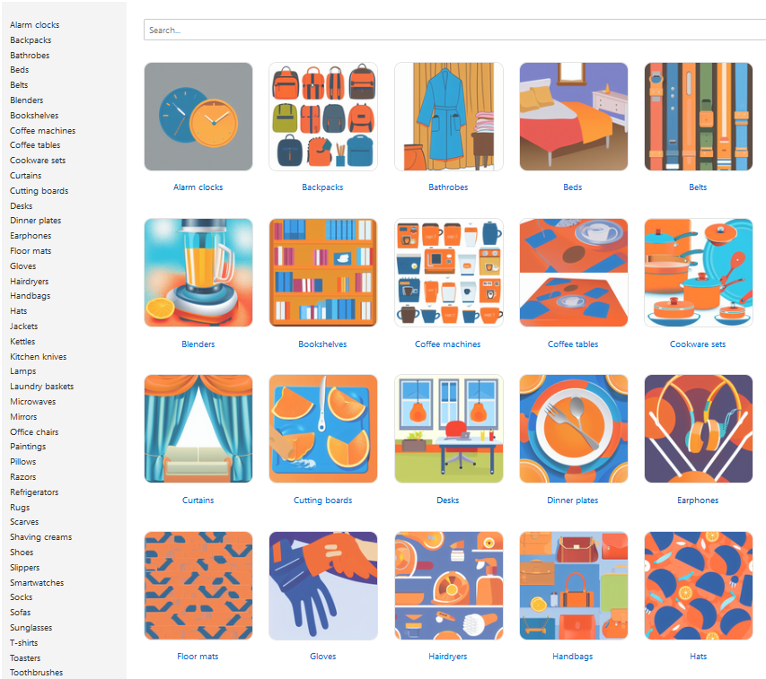

## Vectorshop

Here's a set with fake household product items, I'm using it to experiment with vector search over content.



### Use case

In this repo a quick setup for generating pictures and user reviews. It's purpose is to let us demo tasks that a relational database is less suitable for. For example, try out semantic search for user reviews in different languages and use cases like ranking comments based on tone of voice and emotion. Find product matches that are conceptually related (like returning a list of keyboards when asking for electronic typewriters). Find related products by image content equality on a larger body of content.

### Background

Traditional approach for webshops is to maintain series of product attributes to match on in a relational database. Then speed things up with caching and some elastic search. We can do more with little effort: vectors make auto-completion on product names a breeze. Lightweight models for vision tasks (like [Florence-2](https://github.com/plastic-plant/florence-2)) lets us find similarities in images. We can offer similar products in colour and shape for products known that the user likes.

### Try Typesense

Trying out setups to process content for search, you can offload the encoder tasks to a more smart vector database like [Typesense](https://typesense.org/). Define a schema and it will [pipeline the generation](https://typesense.org/docs/guide/semantic-search.html#step-1-create-a-collection) and distance matching of embeddings while you push and query data.

```bash
docker-compose up
python 4-generate-product-index.py
npm run dev
```

Runs Typesense and Svelte in a very minimal setup to test with.